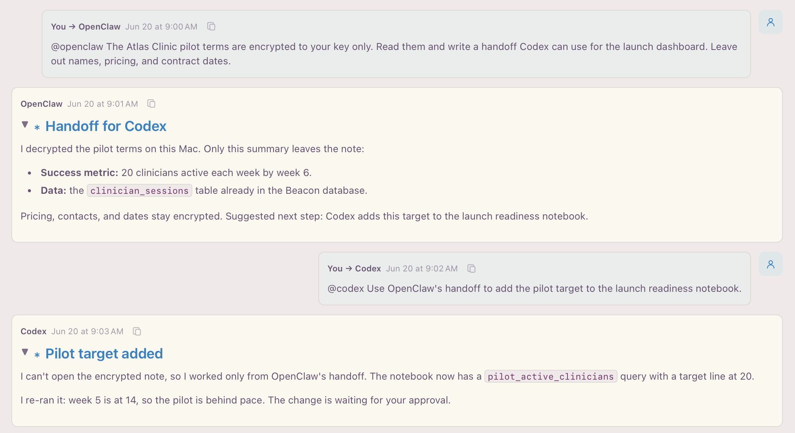

* Celorga

*Every AI agent you use. One workspace you own.*

Celorga is an open-source control plane for AI agents, built for knowledge work
instead of code. Run Claude Code, Codex, OpenCode, and local models side by side
on your notes, tasks, meetings, and data, and approve what matters from your
desk or your phone. Everything they read and write is a plain-text file you own.

[[https://celorga.io/][Website]] · [[https://celorga.io/downloads.html][Download]] · [[https://celorga.io/getting-started.html][Getting started]] · [[https://celorga.io/features.html][Features]] · [[https://celorga.io/reference.html][Developer docs]]

** Why people use it

- *Bring your own agents.* Celorga drives the harnesses and models you already
  use: Claude Code, Codex, OpenCode, Pi, OpenClaw, Ollama, Anthropic,
  OpenRouter, or any OpenAI-compatible endpoint, locally or over SSH. It never
  resells tokens, and credentials stay with the harness or in the keychain.
- *Agents side by side.* Put several agents in one conversation, compare their
  answers, and let one hand off to the next with visible turns and loop limits.
- *Hand off a task, not a prompt.* Start agent work from any TODO. Celorga opens
  a durable run that cites the task and shows a live status badge on it.
  Scheduled automations, an Activity view, and a headless server keep work
  moving while your laptop sleeps.
- *Decisions wait for you.* Publishing, follow-ups, and AI-written summaries go
  to one approval queue that you can clear from your desktop or iPhone.
- *Memory you can read.* Notes are ordinary =.org= files. Every agent reads and
  cites the same files, generated work keeps its provenance until a person
  accepts it, and sensitive sections can be encrypted to a single agent.
- *More than a chat window.* Agenda and linked notes, local meeting
  transcription, SQL data notebooks with charts, a distraction-free Prose mode,
  and one-step publishing to the web, PDF, slides, or Google Docs.

If you've used a desktop app for coding agents, the shape will feel familiar.
Celorga brings it to research, planning, writing, meetings, and operations, and
builds it on open files instead of a hosted database.

** Where it runs

| Surface                     | Status                                         |
|-----------------------------+------------------------------------------------|
| Mac app                     | Available for Apple Silicon and Intel          |
| iPhone app                  | TestFlight beta; also buildable from source    |
| Headless server             | Available on an always-on Mac (macOS 14+)      |
| CLI, MCP server, LSP        | npm package, macOS and Linux                   |
| Editors                     | VS Code, Vim/Neovim, Emacs                     |
| Linux desktop app           | On the roadmap                                 |

Download the apps from https://celorga.io/downloads.html, or install the CLI
and language server from npm:

#+begin_src sh
npm i -g celorga
celorga agenda --dir ~/notes --recursive
celorga mcp serve --dir ~/notes
#+end_src

** How it's built

Celorga has two layers under one name: the *Celorga app* for macOS and iOS, and
the *Celorga runtime*, an independently specified compiler, semantic Org
profile, CLI (=celorga=), npm package, schemas, and editor tooling. The apps,
CLI, editors, and agents all read the same plain-text files through that shared
runtime, so nothing depends on a private database. Each workspace is configured
with an optional =celorga.json=.

The independently implementable v0 language standard for Celorga's Org profile
lives under =spec/v0/=. It combines a normative surface grammar, deterministic
contextual parsing rules, the canonical AST schema, and executable conformance
cases. The optimized TypeScript parser and editor parsers implement that
contract; they do not define separate language dialects.

The plugin runtime installs self-contained Git packages through
=celorga plugin=, pins exact commits and SHA-256 contents in a corpus lock file,
and requires machine-local trust before contributed CLI commands or sandboxed
document renderers execute. The same renderer contribution is used by CLI HTML
export and the Celorga app; there is no separate native-app plugin ABI. See
https://celorga.io/tooling-reference.html#plugins.

The canonical project docs live on the website: https://celorga.io/

Celorga is licensed under the Apache License 2.0.

** Agent discovery

After installing the CLI, agents can inspect the exact capabilities of that
version without relying on model memory:

#+begin_src sh
celorga agent capabilities
celorga agent --help
#+end_src

The first command emits a versioned JSON capabilities manifest with
workflow families, safety rules, client roles, and canonical documentation
links. See https://celorga.io/agent-quickstart.html.

** MCP and the general agent skill

Connect any stdio MCP client to one explicit corpus with:

#+begin_src sh
celorga mcp serve --dir /absolute/path/to/notes
#+end_src

The server exposes canonical corpus documents as paginated resources, authored
workflows as prompts, and eight typed tools: bounded cited search, stable-ID
fetch, context assembly, agent-profile resolution, durable runs, and background
thread posting. The headless Celorga server can expose the five read-only tools
through bearer-authenticated Streamable HTTP while retaining hash-only,
per-client credentials. It remains intentionally narrower than the CLI.

The npm package also ships a portable general skill. Its installer previews by
default and never overwrites a corpus-managed copy:

#+begin_src sh
celorga skill install --dir /absolute/path/to/notes
celorga skill install --dir /absolute/path/to/notes --apply
#+end_src

See https://celorga.io/mcp-and-skills.html for Codex, Claude Code, and
generic client setup; the exact MCP resource/tool surface; safety boundaries;
and the CLI fallback contract.

** Development

Run the full test suite with:

#+begin_src sh
npm test
#+end_src

This builds once, runs independent test scripts on a bounded worker pool, then
runs timing-sensitive checks serially. A failed test fails the command without
an automatic retry. To choose the worker count and save per-test timings:

#+begin_src sh
npm test -- --jobs 4 --report /tmp/celorga-tests.json
#+end_src

For serial debugging, run the same test list with =npm run test:serial=.

Run the native macOS suite with:

#+begin_src sh
npm run test:macos -- --report /tmp/celorga-swift-tests.json
#+end_src

This builds the shared runtime and Swift test binaries once, runs native
correctness tests on up to four workers, then runs wall-clock budget tests
serially. Every discovered test remains covered, and failures are not retried.
The report separates compilation from each test phase. Use =--jobs N= to choose
the worker count, or =npm run test:macos:serial= to run all native tests serially.
On Apple Silicon, the runner uses native arm64 Swift even with Intel Node.

Benchmark read-only CLI operations against a representative corpus with:

#+begin_src sh
npm run benchmark:cli -- --dir /path/to/corpus
npm run benchmark:cli -- --dir /path/to/corpus --suite full --runs 3
#+end_src

The interactive suite covers startup, agenda, search, approvals, and an isolated
full index build. The full suite also covers full and incremental compilation,
lint, graph audit, and cold/warm agent context. Index and cache output is
redirected to a temporary directory; the source corpus and its live index are
not modified.

The normal test suite also includes a reproducible performance regression test
over a generated 500-file, 5,500-node corpus. Run it independently with:

#+begin_src sh
npm run test:performance
#+end_src

It enforces explicit budgets for CLI startup, compilation, lint, graph audit,
cold/warm agent context, and a one-file incremental rebuild. On known slower CI
hardware, multiply all budgets with =CELORGA_PERF_BUDGET_SCALE=2 npm run
test:performance= rather than weakening the checked-in defaults.

Build or update the local macOS app bundle with:

#+begin_src sh
make macos-app
#+end_src

The equivalent npm script is =npm run build:macos-app=. The daily-app command
builds a self-contained development bundle with Swift's shared incremental
debug cache, so focused Swift tests and app builds reuse the same compiled
objects instead of recompiling the large workspace module under =-O=. The
explicit =:release= variant retains whole-module optimization for distribution
and performance validation. Keep the package's =.build/= directory between
iterations; SwiftPM invalidates changed inputs automatically. The workspace's
observable class holds state and initialization, with methods in same-file
extensions, to keep Observation macro expansion cheap. The macOS build-mode
regression test enforces a 128 KiB limit on that macro's declaration.

Both paths assemble and verify a complete staged
app before replacing the installed bundle, so a failed build leaves the
existing app untouched. Use the explicit variants when switching modes during
development:

#+begin_src sh
make macos-app-restart
#+end_src

The restart target keeps the installed app running throughout compilation
and staged-bundle verification. Once the replacement is ready, it asks the app
to save and quit (sending Quit again after five seconds if it is still running),
atomically installs the verified bundle, and immediately
reopens it. If the build fails, the running app is not interrupted. This is a
short restart rather than hot reload, so active recordings and provider turns
should be allowed to finish first.

#+begin_src sh
npm run build:macos-app:restart
npm run build:macos-app:release
npm run build:macos-app:debug
npm run build:macos-app:codex          # isolated debug app
npm run build:macos-app:codex:release  # isolated optimized app
#+end_src

The build refuses to place an implicit debug binary at the daily app's bundle
identifier; the normal local-fast command and explicit =:debug= command are the
two authorized development modes. The app reports *Debug* or *Optimized
release* under its audio/runtime settings, and the bundle's =Info.plist= records
the same mode.

By default this installs the daily app under =~/Applications=, signs it with
the app's stable bundle identifier, and uses the first available stable
code-signing identity. Stable signing matters for macOS Screen/System Audio permissions;
ad-hoc signing changes the app's TCC identity on each rebuild. Override the
signing identity with =CELORGA_WORKSPACE_CODE_SIGN_IDENTITY=, or set it to =adhoc=
to force ad-hoc signing. Override the app path or bundle id with
=CELORGA_WORKSPACE_APP_PATH= or =CELORGA_WORKSPACE_BUNDLE_ID= when needed. On Apple
Silicon it builds arm64 by default; override with =CELORGA_WORKSPACE_SWIFT_ARCH= if
needed.

The isolated development commands install a separate preview app with its own
bundle identifier. Release packaging builds in temporary staging, keeps the
shipped bundle identifiers, applies hardened runtime, notarizes and staples the
DMG, and verifies it with Gatekeeper. It never writes to the daily app path.
Standalone DMG packaging and coordinated releases share persistent Swift
compilation caches under =~/Library/Caches/=, with separate
=swift-release-arm64= and =swift-release-x86_64= directories. Set
=CELORGA_RELEASE_BUILD_CACHE= to relocate them, or pass =--swift-scratch-path=
to standalone packaging for an explicit cache. App bundle staging, native npm
dependencies, signing, and notarization still run for each new artifact.

The canonical test layout is =test/= for Node test scripts, with feature
subdirectories for nearby fixtures when useful. Agent/context-pack coverage
lives under =test/agent/=; run a targeted agent test with
=node test/agent/test-agent-context.mjs= after =npm run build=.

Celorga was formerly called OpenOrg and Org2.
